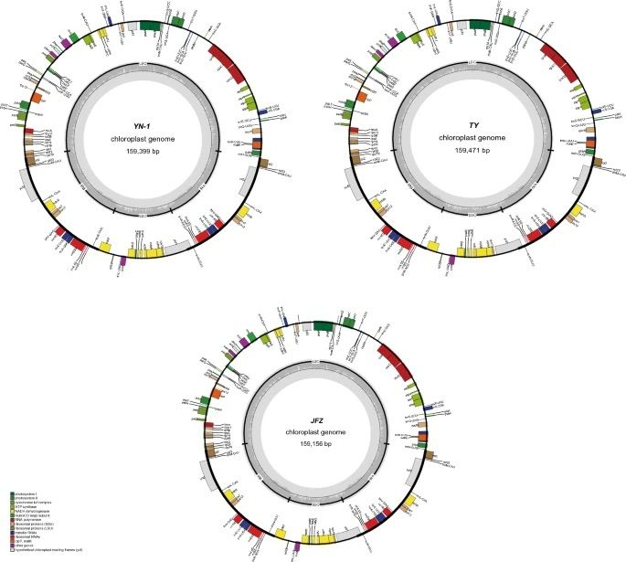

# **Galaxy in Research: Uncovering the evolutionary secrets of wild loquats using comparative chloroplast genomics**  
   
*A new study has sequenced and analyzed two wild loquat chloroplast genomes, revealing key insights into their evolutionary history and the genetic diversity of loquat species.*  
   
Researchers have successfully sequenced and assembled the chloroplast genomes of *Eriobotrya elliptica* and an unidentified wild loquat species named “YN-1.” Comparative genomic analysis was conducted across six loquat species, including five wild loquats and one cultivated variety. The study identified variations in gene content, repetitive sequences, and RNA editing sites, shedding light on loquats' genetic diversity and evolution. This research contributes to a deeper understanding of species differentiation and adaptation in wild loquats.  
   
## **Key Findings**

* Compared to other loquats, the chloroplast genomes of *E. elliptica* and “YN-1” have 127 genes, including an extra psbK gene.

* Specific regions such as trnF-GAA-ndhJ and petG-trnP-UGG showed high variability.

* Positive selection was detected in genes rpl22 and rps12, with chilling stress-specific RNA editing sites in the rpl2 gene.

* Phylogenetic analysis places “YN-1” closely related to *E. elliptica*, *E. obovata*, and *E. henryi*, suggesting it is a new wild loquat species.

*Three gene maps: E. elliptica, “YN-1”, and “JFZ” (Lin et al., 2024).*  
   
## **Galaxy’s Role**  
   
The Galaxy platform was instrumental in this research, particularly in performing the **Codon Adaptation Index (CAI)** analysis, a crucial step in understanding gene expression levels across different loquat species. CAI measures how efficiently genes are adapted to a species' translational machinery, giving insights into the evolutionary pressure on protein-coding genes. Using Galaxy, the researchers calculated CAI seamlessly, integrating various genomic tools into a unified workflow.  
   
## **Significance of the Study**  
   
This research provides critical insights into the genetic evolution of wild loquats and contributes to a broader understanding of species differentiation and adaptation. The discovery of species-specific SSRs, along with RNA editing patterns linked to environmental stress, offers valuable data for conservation efforts and future studies on the evolutionary biology of loquats.  
   
## **Acknowledgment**  
   
We extend a special thank you to the authors, Zhicong Lin, Qing Guo, Shiwei Ma, Hailan Lin, Shunquan Lin, Shoukai Lin, and Jincheng Wu, for using Galaxy to power their comparative genomic research. Their work showcases Galaxy’s capabilities in advancing plant genomics and evolutionary studies.  

--- <be> 
   
Lin, Z., Guo, Q., Ma, S. et al. Chloroplast genomes of Eriobotrya elliptica and an unknown wild loquat “YN-1”. Sci Rep 14, 18816 (2024). https://doi.org/10.1038/s41598-024-69882-7  
