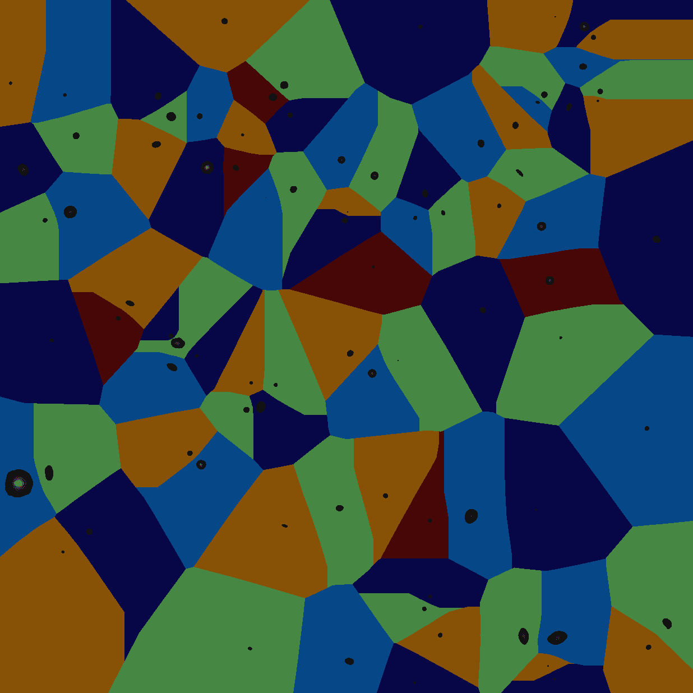

In an exciting step forward for astronomical data analysis, the WP5 EPFL team has developed a Galaxy workflow that applies Voronoi segmentation techniques to [Legacy Surveys / D. Lang (Perimeter Institute)](https://www.legacysurvey.org/) imaging data. This [workflow](https://usegalaxy.eu/published/workflow?id=bc78c184fabcff1d), adapted from the cross-disciplinary [Galaxy Training Network tutorial](https://training.galaxyproject.org/topics/imaging/tutorials/voronoi-segmentation/tutorial.html), incorporates tools for querying astronomical data and converting it into PNG format for image processing. 
By integrating data from major astronomical surveys into the Galaxy platform, this workflow enables scientists to perform complex image analyses in a fully reproducible and shareable environment - paving the way for novel approaches to studying celestial structures and conducting detailed morphological analyses of galaxies.

Key features of the workflow include:
* Fetching Legacy Surveys FITS data for user-defined sky regions.
* Converting FITS files to PNG format to enable downstream image processing.
* Applying adaptive histogram equalization and noise-reduction filters.
* Performing Voronoi segmentation to detect and outline objects of interest.
* Extracting quantitative measurements from segmented regions (e.g., area, intensity).

<figcaption>
Workflow output for RA = 53.16216667; Dec = -27.79149167; Radius = 2.7 arcmin; Pixel size = 0.262 arcsec; Band = g.
</figcaption>

The authors have observed that the "Stretch image scale" parameter of the [*astropy fits2bitmap* tool](https://usegalaxy.eu/root?tool_id=toolshed.g2.bx.psu.edu/repos/astroteam/astropy_fits2bitmap/astropy_fits2bitmap/0.2.0+galaxy1), along with the method used to create the seed, significantly affects the outcome of the Voronoi segmentation - highlighting opportunities for further refinement and customization of the workflow. Therefore, the Galaxy community encourages further experimentation and invites researchers to adapt and extend the workflow for their own use cases. 

A public version of the workflow is now available on [usegalaxy.eu](https://usegalaxy.eu/published/workflow?id=bc78c184fabcff1d) and on [WorkflowHub](https://workflowhub.eu/workflows/1730).
