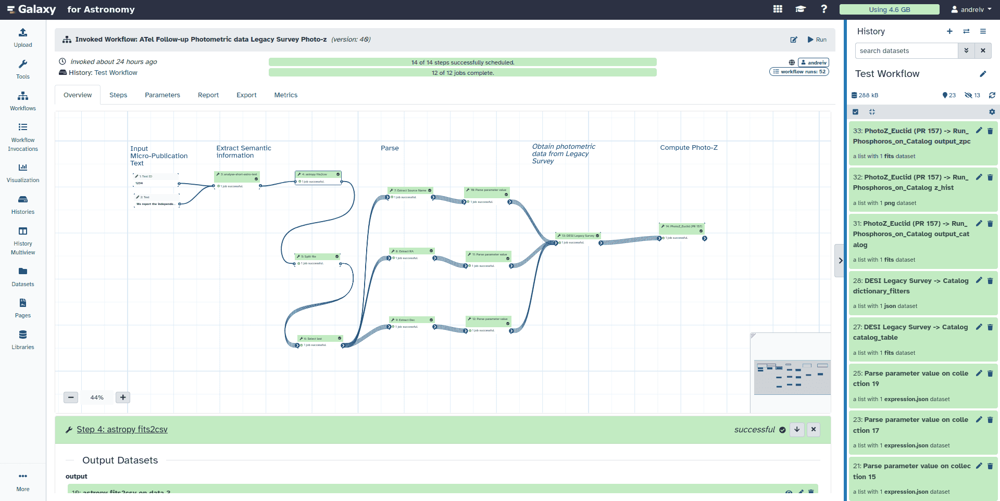

The WP5 EPFL team is excited to share a new Galaxy workflow that facilitates follow-up analysis of astronomical transient events mentioned in bulletins such as [ATels](https://astronomerstelegram.org/) or [GCN Circulars](https://gcn.nasa.gov/circulars).

The workflow begins with a **text mining** step using a public [Galaxy tool](https://toolshed.g2.bx.psu.edu/repos/astroteam/analyse_short_astro_text_astro_tool/) that extracts coordinates of the mentioned astrophysical sources and outputs them in a FITS file (i.e. a standard way to store data in astronomy).
Next, the FITS file is converted into more accessible CSV using an [astropy based tool](https://astronomy.usegalaxy.eu/root?tool_id=toolshed.g2.bx.psu.edu/repos/astroteam/astropy_fits2csv/astropy_fits2csv/0.2.0+galaxy1), making the data easier to explore and manipulate in Galaxy’s interface.

The resulting source table is then **split into individual sources**, and for each source, a cone search is performed using the [DESI Legacy Survey](https://astronomy.usegalaxy.eu/root?tool_id=toolshed.g2.bx.psu.edu/repos/astroteam/desi_legacy_survey_astro_tool/desi_legacy_survey_astro_tool/0.0.1+galaxy0). This fetches all nearby optical candidates in the [Legacy Survey](https://www.legacysurvey.org/) catalog.

Finally, a **photometric redshift estimation** step is carried out for each candidate using a [Phosphoros-based](https://github.com/astrorama/PhosphorosCore) tool (currently in staging) deployed on a [local](https://odahub.io/) Galaxy [instance](https://galaxy.odahub.fr/). This allows researchers to assess the distances of candidate counterparts to observed transient sources.

<figcaption>
The overview of the workflow invocation on ODA Galaxy instance.
</figcaption>

The full workflow is publicly available on:
- [WorkflowHub](https://workflowhub.eu/workflows/1353?tab=files)
- [Galaxy instance @ ODA](https://galaxy.odahub.fr/u/andreiv/w/atel-follow-up-photometric-data-legacy-survey-photoz)

This workflow represents a step toward reproducible, automated follow-up analysis of transient events in astronomy.
