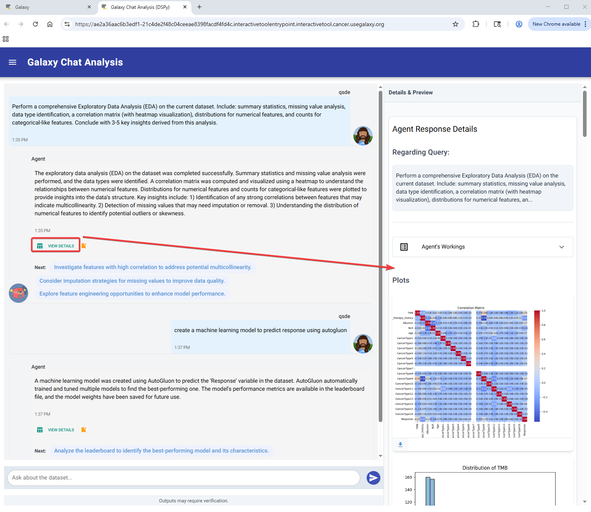

### AI-augmented data analysis in Galaxy

We’re thrilled to announce the launch of the Galaxy Data Analysis Agent, a powerful new interactive tool(IT) integrated within Galaxy. This agent leverages cutting-edge Large Language Models (LLMs) like ChatGPT and DeepSeek to enable scientists to perform sophisticated data analyses using natural language—no coding required. The tool has been deployed at usegalaxy.org: [link](https://usegalaxy.org/root?tool_id=toolshed.g2.bx.psu.edu/repos/goeckslab/chatanalysis/interactive_tool_chat_analysis/0.3.0)

### What Can You Do With It?

- Describe analyses intuitively with simple natural language queries such as:
  - “Generate a heatmap”
  - “Summarize this table”
  - “Run a t-SNE”
- Receive detailed visualizations, generated code, and clear explanations.

### Evolution of the Galaxy Data Analysis Agent

#### Version 0.1
- Utilized pandas-ai
- Basic context-awareness, supporting multiple LLMs
- Limitations in complex reasoning and output generation

#### Version 0.2
- Adopted SmolAgents
- Introduced ReAct (Reasoning and Acting)
- Supported broader libraries, detailed intermediate steps
- Capability for multiple plots and outputs per query

#### Version 0.3 – The Latest Version
- Powered by DSPy with bootstrap few-shot learning
- Improved user interface and faster responses
- Enhanced machine learning analysis performance
- Bookmarking for easy revisitation of previous analyses

### How It Works

- Obtain your API key from OpenAI or Groq (we plan to support additional LLM providers) and configure it in User Preferences or immediately after launching the Interactive Tool (IT) instance.
- Navigate to the tool’s page, select your dataset in Galaxy, and run the tool.
- Open the IT instance.
- Enter your natural-language query.
- The agent compiles dynamic prompts from your provided examples and generates executable code.
- The agent runs the code and returns visualizations, intermediate steps, and detailed explanations.

This workflow simplifies data analysis significantly, allowing for reproducible, robust, and no-code exploratory analyses.

### Future Developments

We are continually enhancing the agent with upcoming features:

- Select additional datasets from user histories in real time.
- Write analysis outputs back into user histories in real time.

### Galaxy and Bioconductor Conference Presentation

Join our detailed presentation to learn more:

- **Date & Time:** June 24, Afternoon, Session 2A

### Acknowledgments

We gratefully acknowledge support from the Moffitt Cancer Center and NIH grants U24CA284167, U24CA231877, U41HG006620, and U24HG010263.

[Explore More on Galaxy](https://galaxyproject.org) | [Goecks Lab](https://goeckslab.org)
